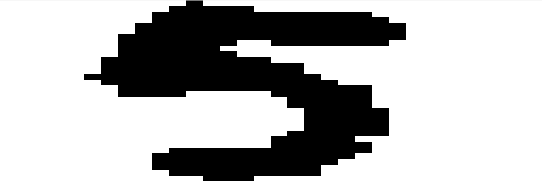

# 神经网络识别数字

---

## 内容列表

### data --存放数据
* digit-training.txt 训练数据，共1934个
* digit-testing.txt 测试数据，共943个
* digit-predict.txt 识别数据，共12个
* img 图片数据，共6个

### image --存放图片

### src --存放源码
* neuralNetwork.m 神经网络类，有train方法和query方法
* activation_function.m 激活函数
* getData.m 读取数据函数
* plotDigit.m 画数字图函数
* main.m 主程序，进行训练、测试、识别
* network.mat 已经训练好的神经网络

## 数据及数据处理

数字数据是用32x32个0/1来表示的，例如：

00000000000100000000000000000000 
00000000001111100000000000000000 
00000000011111111111110000000000 
00000000011111111111111000000000 
00000000111111111111111100000000 
00000000111111111111111100000000 
00000001111111111111111100000000 
00000001111111001111111000000000 
00000001111110000000000000000000 
00000001111111000000000000000000 
00000011111111110000000000000000 
00000011111111111100000000000000 
00000011111111111100000000000000 
00000111111111111110000000000000 
00000011111111111111000000000000 
00000001111111111111110000000000 
00000001111000001111110000000000 
00000000000000000111110000000000 
00000000000000000111110000000000 
00000000000000000011111000000000 
00000000000000000011111000000000 
00000000000000000011111000000000 
00000000000000000011111000000000 
00000000000000000111111000000000 
00000000000000001111100000000000 
00000000000000001111110000000000 
00000000001111111111110000000000 
00000000011111111111100000000000 
00000000011111111111000000000000 
00000000011111111110000000000000 
00000000001111111110000000000000 
00000000000011100000000000000000 

就是数字5。 
将0/1换成像素点，0=>(255,255,255);1=>(0,0,0): 
 
(因为matlab作图原因，显示出来的是一个矩形)
  
在导入数据时，一个矩阵有1025个值，前1024个值为
0/1，最后一个值为该数字(训练数据和测试数据为该数字
，预测数据都为9)，即设置1024个特征点。

## 训练过程

首先，传入数据和目标，例如上边的5，数据就是1024个0/1，目
标为[0.01,0.01,0.01,0.01,0.01,0.99,0.01,0.01,0.01,0.01],
分别为0~9的概率。(0设为0.01而不是0,1设为0.99而不是1，是为了
防止过大权重) 之后，将数据传入隐藏层，与权重进行点乘，
然后将输出与输出层点乘，得到最后的输出。再将输出与目标进
行做差，得到误差。最后，根据误差来更新权重。

## 训练与测试结果（某一次）

### Training Info
---
 | digit| : |  number |
 | :---: | :---: | :---:  |
 | 0 | : | 189 |
 | 1 | : | 198 |
 | 2 | : | 195 |
 | 3 | : | 199 |
 | 4 | : | 186 |
 | 5 | : | 187 |
 | 6 | : | 195 |
 | 7 | : | 201 |
 | 8 | : | 180 |
 | 9 | : | 204 |		 
 
---
 ### Testing Info
---
 | digit | : | accuracy |
 | :---: | :---: | :---: |
 | 0 | : | 100% |
 | 1 | : | 95.7447% |
 | 2 | : | 97.8495% |
 | 3 | : | 89.5238% |
 | 4 | : | 75.8621% |
 | 5 | : | 90.1235% |
 | 6 | : | 97.8947% |
 | 7 | : | 92.2222% |
 | 8 | : | 88.0734% |
 | 9 | : | 60.6742% |
 
---

## 代码所能实现的功能

1.判断是否存在已有训练好的神经网络。 
2.用户可以选择使用已有的神经网络或重新训练。 
3.用户可以使用digit-predict.txt中的数据也可以自己传入图片，进行识别。 
(传入图片路径时，要加引号，例如:'./data/test.jpg')

## 注意事项

1.训练数据只有不到2000个，所以准确率可能会有点低。 
2.对数字9的识别率一直很低，甚至又可能不到20%。 
3.由于matlab的原因，训练所花费的时间有点长（用python跑只要2s）。 
4.对图片进行识别时，会改变图片的大小为32x32，所以图片会存在失真，而且颜色也不纯，导致图片的识别率较低。 
5.后续会增加训练数据和测试数据，并且改善代码。

## 结语

为了完成这个神经网络，自学了matlab的类。刚开始时，测试数据的准确率一直低于5%，
找了4天的bug，最后才发现是类没有继承handle，导致权重没有更新。 
通过这个小项目，我对matlab有了更加深入的学习。希望以后能更加完善这个代码。

